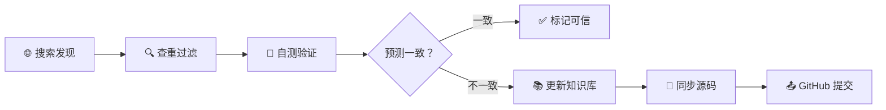

# 🏮 Chaoshan Agent — 潮汕文化 Agent（自演进）

> 潮汕话 ↔ 普通话 双向翻译，带潮州拼音（Peng'im），涵盖语法转换、文化注释、俗语解释。  
> **这是一个会自己长大的项目** — 白天有人用，凌晨自己学。

一个面向潮汕文化传承的 AI Agent 项目，以 **Hermes Agent Skill** 为载体，提供高质量的潮汕话翻译与文化知识服务。

## ♻️ 自演进设计

本项目最大的特点是**自动学习、自动更新、自动发布**。每天凌晨 3:00，系统自动执行以下流程：



### 具体步骤

| 步骤 | 说明 |
|------|------|
| **1. 搜索发现** | 从网上搜索潮汕话↔普通话翻译对（目标：每天 50 个样本） |
| **2. 查重过滤** | 检查当前词典（dictionary.yaml / slang.yaml）是否已收录 |
| **3. 自测验证** | 用已有 skill 知识翻译预测，与搜索结果对比 |
| **4. 学习更新** | 如果翻译错误且数据可靠，追加到词典/俗语文件中 |
| **5. 同步源码** | 更新 Hermes 运行目录 + 源码仓库目录，保持一致 |
| **6. GitHub 提交** | 自动 commit + push 到 github.com/frelam/chaoshan-agent |

> 不确定的数据会写入 `references/pending-vocab-merge.md` 待人工审核，不会直接污染词典。

### 为什么要这样设计？

- **潮汕话资料分散** — 网上有大量词汇帖子、问答、教学视频，但缺乏结构化语料库
- **人工收集慢** — AI 每天自动搜索 50 条，一个月就是 1500 条候选，效率远超手工
- **质量可控** — 自测验证 + 不一致丢弃 + 不确定待审，三重过滤保证数据质量
- **开源自动更新** — 每天提交 GitHub，所有人随时可拉取最新知识库

## ⚡ 快速安装

```bash
git clone https://github.com/frelam/chaoshan-agent.git
cd chaoshan-agent
bash install.sh
```

安装后重启 Hermes Agent 即可使用（或发送一条消息自动触发加载）。

## ✨ 功能

- 🔄 **双向翻译** — 潮汕话 ↔ 普通话，保留语气、语序、文化内涵
- 🔊 **潮州拼音（Peng'im）** — 所有潮汕话输出带 1-8 调号标注
- 📖 **语法解析** — 语序转换（V+先→先+V）、否定词辨析（唔/无/未/免/𠀾/莫）、程度副词转换
- 🏮 **文化注释** — 俗语典故、工夫茶文化、文白异读、区域变体（潮州/汕头/揭阳/汕尾）
- 🤖 **AI 驱动** — 基于 Claude Code CLI 开发，支持在 Hermes Agent / Claude Code 中无缝使用

## 📁 项目结构

```
chaoshan-agent/
├── skills/teochew-translate/     # 核心潮汕话翻译 Skill
│   ├── SKILL.md                   # 技能定义（触发词、翻译流程、15个 Few-Shot 示例）
│   ├── data/
│   │   ├── dictionary.yaml        # 113+ 词汇（代词、问候、食物、情感等）
│   │   ├── grammar.yaml           # 完整语法体系（语序、否定词、程度副词等）
│   │   ├── examples.yaml          # 30组情景化翻译例句
│   │   └── slang.yaml             # 38+ 俗语、粗口、亲属称谓、有音无字词
│   ├── teochew-self-evolve/       # 自演进策略（每日50样本学习流程）
│   ├── references/                # 待审词汇、技术参考
│   └── tests/cases.yaml           # 翻译测试用例
├── teochew-prompt.txt             # 潮汕话专家系统提示词
├── update-skill-prompt.txt        # 知识更新提示词
├── fewshot-prompt.txt             # Few-Shot 聚合提示
├── ARCHITECTURE.md                # 架构设计文档
├── run_claude.py                  # Claude Code 运行脚本
├── install.sh                     # 一键安装脚本
└── run-teochew.sh                 # 潮汕话专家启动脚本
```

## 🚀 使用方式

### 在 Hermes Agent 中使用

安装到 Hermes skills 目录后，直接发送潮汕话或普通话即可：

```
用户：瓦爱来去踢桃
Agent：我想去玩
       拼音：ua2 ain3 lai5 ke3 ti1 tho5
       「踢桃」是有音无字词，借音写法……
```

### 在 Claude Code 中使用

```bash
# 使用 teochew-prompt.txt 作为系统提示
claude -p "$(cat teochew-prompt.txt)" -f "需要翻译的文本"
```

## 🌐 覆盖内容

- **日常对话**：问候、购物、吃饭、出行
- **文化专词**：粿条、蚝烙、工夫茶、甜粿等
- **语法体系**：11 种否定词、比较句、被动句、完成体等
- **俗语谚语**：平安当大赚、胶己人等 10+ 条
- **粗口/詈语**：学术性记录，标注冒犯程度与使用场合
- **有音无字词**：niam5、gog8、ziêg4、koi1 等

## 🧠 技术栈

- **Hermes Agent** — 插件化 Agent 框架，作为 Skill 运行，cron 驱动自演进
- **Claude Code CLI** — 架构设计、代码生成、测试
- **YAML** — 结构化知识存储（词典、语法、例句、自演进策略）
- **潮州拼音（Peng'im）** — 8 调系统，汕头市区音为标准
- **GitHub Actions（计划中）** — CI 自动验证测试用例，防止回归

## 📜 许可

MIT
